<h1>henrybank</h1>

<p align="center">
</img>
</p>

## Acerca del proyecto

henrybank es una billetera electrónica, que te ayudara a gestionar tu dinero, podrás enviar dinero, recibir y hasta ver tus movimientos y estadísticas de los últimos días. Todo esto en base a una cuenta que creas cuando te registras en nuestra app: se te asignará un CVU en pesos y otro en dólares. A partir de ahí, podrás disfrutar de todas las funcionalidades que te mencionamos antes.

## Tecnologías usadas

#### Front-End

- React-Native
- React-Navigation
- Redux
- Axios

#### Back-End

- NodeJS
- MoleculerJS
- Mongoose (MongoDB)
- Nodemailer
- JWT
- ChartJS

## Cómo correr el proyecto?

#### Instalar las dependencias del proyecto

1. Posicionate en la carpeta _api_ y ejecuta el comando `npm install`.

```js
// Desde la raiz del proyecto
cd api
npm install
```

2. Posicionate en la carpeta _native_ y ejecuta el comando `npm install`.

```js
// Desde la raiz del proyecto
cd native
npm install
```

#### Setear el proyecto

3. Crea una base de datos en MongoDB. En este ejemplo le pondremos 'henrybank'. Se crea con el siguiente comando:

```shell
 use henrybank
```

4. Crea un archivo dentro de la carpeta _api_ llamado '.env' con el siguiente contenido:

```js
// En api/.env
DATABASE='mongodb://localhost/henrybank'
ADMIN_EMAIL=henrybank.group5@gmail.com
PASSW_EMAIL=HenryBankHenryBank
BACK_URL=http://localhost:3000/
JWT_SECRET=lamejorappdehenryfinal
```

5. Crea un archivo dentro de la carpeta _native_ llamado 'env.js' con el siguiente contenido:

```js
// En native/env.js
module.exports = { BACK_URL: `http://IPv4DeTuPC:3000` }; // Reemplazar 'IPv4DeTuPC' por tu IP
```

> Cómo obtengo mi IP? La respuesta en [este video.](https://www.youtube.com/watch?v=QyDOsj-hQDU)

#### Correr el front-end y el back-end

6. Abrí una consola. En ella, posicionate en la carpeta _api_ y ejecuta el comando `npm run dev`:

```js
// Desde la raiz del proyecto
cd api
npm run dev
```

7. Abrí otra consola (no cierres la otra). En ella, posicionate en la carpeta _native_ y ejecuta el comando `npm start`:

```js
// Desde la raiz del proyecto
cd native
npm start
```

8. Abrí la aplicación de Expo en tu celular (en iOS solo debes escanear el código con la cámara del teléfono) y escanea el código QR. Ahora deberías ver el proyecto corriendo en tu teléfono!

## Pantallas

### Inicio

<p align="center">
    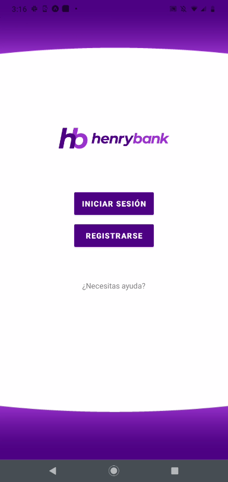</img>
</p>

### Registro y Login - Paso 1: Registro Inicial

Solo debes poner tus datos básicos para el registro.

<p align="center">
 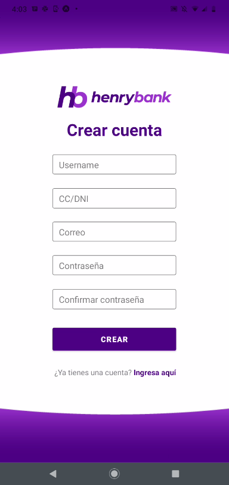</img>
</p>

### Registro y Login - Paso 2: Valida el Código

Una vez termines el paso uno, te enviaremos un correo electrónico con el código correspondiente.

<p align="center">
 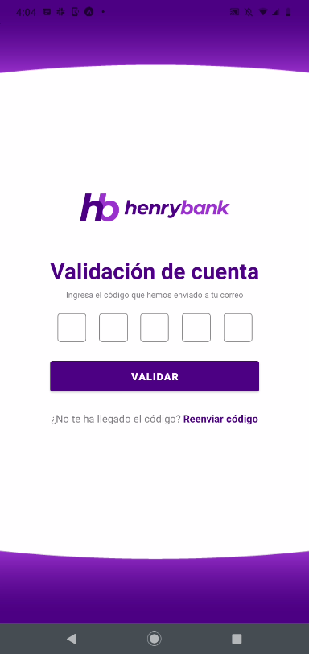</img>
</p>

### Registro y Login - Paso 3: Dar de alta tu cuenta

Una vez valides tu código, tendrás que completar un último paso. Llena el formulario con los datos complementarios.

<p align="center">
 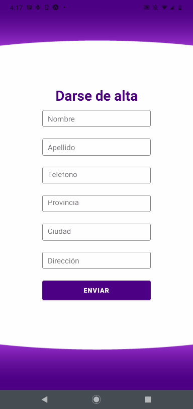</img>
</p>

### Registro y Login - Paso 4: Login

Finalmente, ya puedes loguearte con tu email y contraseña registrados, ahora puedes disfrutar de henrybank.

<p align="center">
 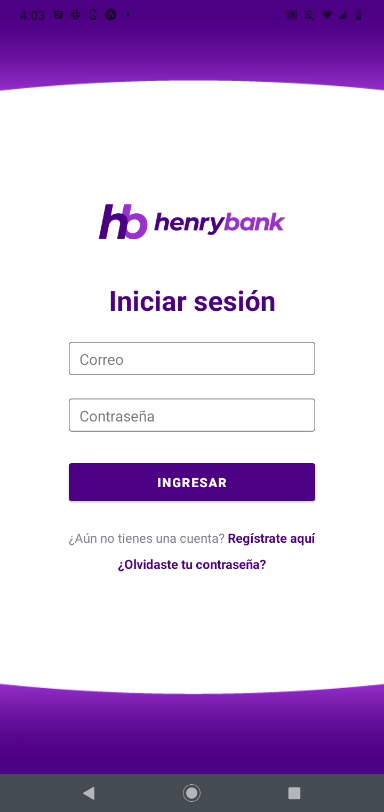</img>
</p>

### Posición Consolidada

Una vez inicies session, podras empezar a navegar y explorar todas las funcionalidades que tenemos para ti.

<p align="center">
 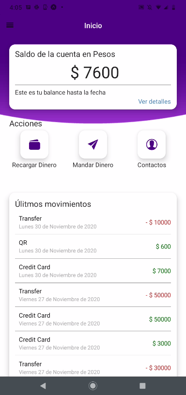</img>
</p>

### Menú lateral

Provee la navegación de todo el sitio en un solo lugar para facilitar el uso del la app.

<p align="center">
 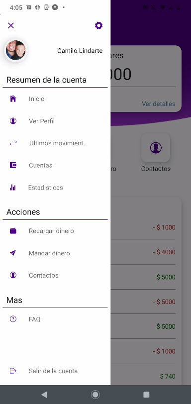</img>
</p>

### Recargar dinero

Recarga dinero a cualquiera de tus dos cuentas por medio de tarjeta crédito o débito, o a través de un código QR que presentaras en cualquier punto de Todo Pago.

<p align="center">
 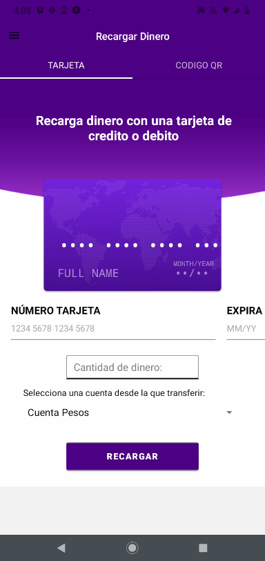</img>
 </img>
</p>

### Mandar dinero

Mandar dinero a tus contactos. Puedes hacerlo desde cualquiera de tus cuentas siempre y cuando tengas saldo disponible.

<p align="center">
 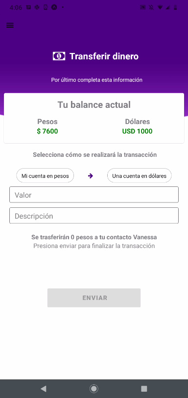</img>
</p>

### Movimientos y estadísticas

Puedes ver tus últimos movimientos en los últimos 15 y 7 días, así como los que realizaste el mismo día. de igual manera tendrás información un poco más específica, ya que contaras con una opción de estadísticas, en las cuales te mostraremos como fue el comportamiento de tu dinero, en el trascurso de los últimos 7 días en cuanto a ingreso y egresos.

<p align="center">
 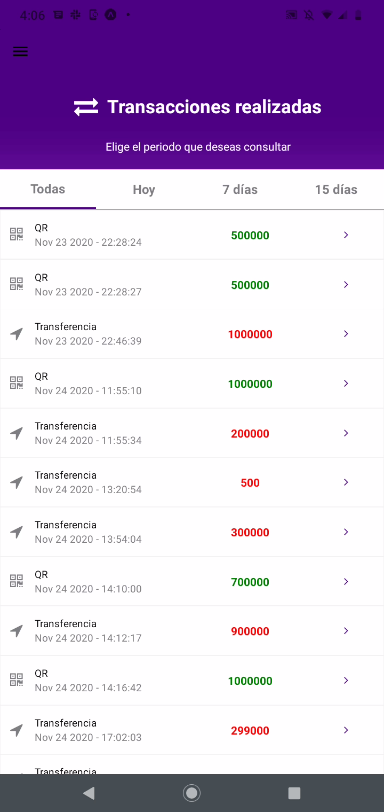</img>
 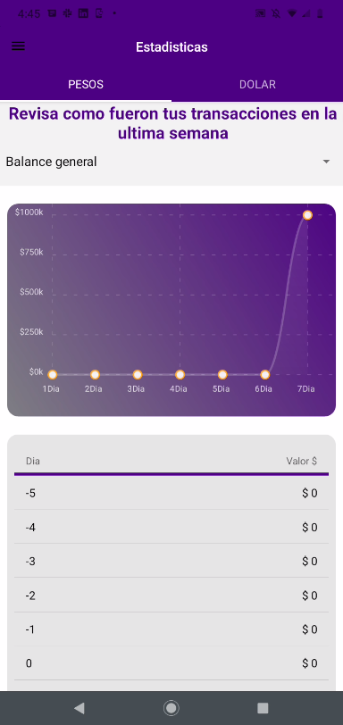</img>
</p>

### Contactos

Podras ver todos los contactos que tienes registrados en tu cuenta.

<p align="center">
 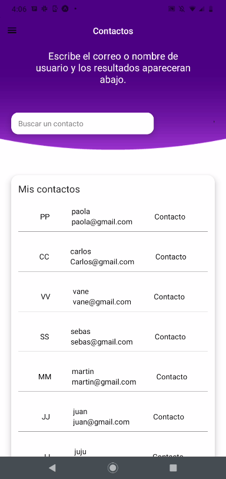</img>
</p>

### Preguntas y respuestas

Si quieres conocer o tienes dudas acerca de cómo funciona la aplicación, tendrás un opción para responder lo que necesites.

<p align="center">
 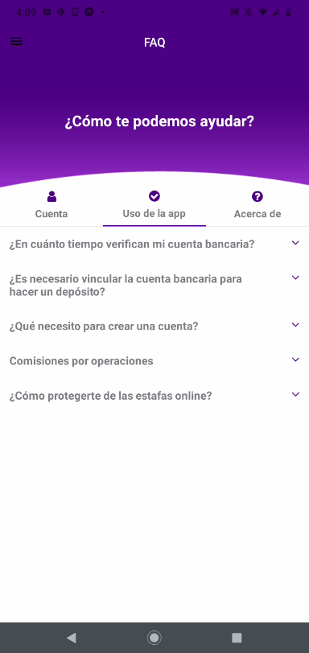</img>
</p>

### Equipo

El equipo de desarrollo lo conforman los siguientes desarrolladores:

- <a href="https://github.com/CamilolIn" rel="nofollow">Camilo Lindarte </a>
- <a href="https://github.com/quasirsg" rel="nofollow">Alexis Romano </a>
- <a href="https://github.com/nvlozano" rel="nofollow">Carlos Saballe</a>
- <a href="https://github.com/martinc1991" rel="nofollow">Martín Catalá</a>
- <a href="https://github.com/JuanFernandezJubin" rel="nofollow">Juan Ignacio Fernandez</a>
- <a href="https://github.com/olivertborges" rel="nofollow">Olivert Borges </a>
- <a href="https://github.com/gabbies86" rel="nofollow">Gabriela Marciano </a>
- <a href="https://github.com/Ceci-Caccamo" rel="nofollow">Ceci Caccamo </a>
- <a href="https://github.com/sebasf24" rel="nofollow">Sebastian Fernandez.</a></li> </ul>
